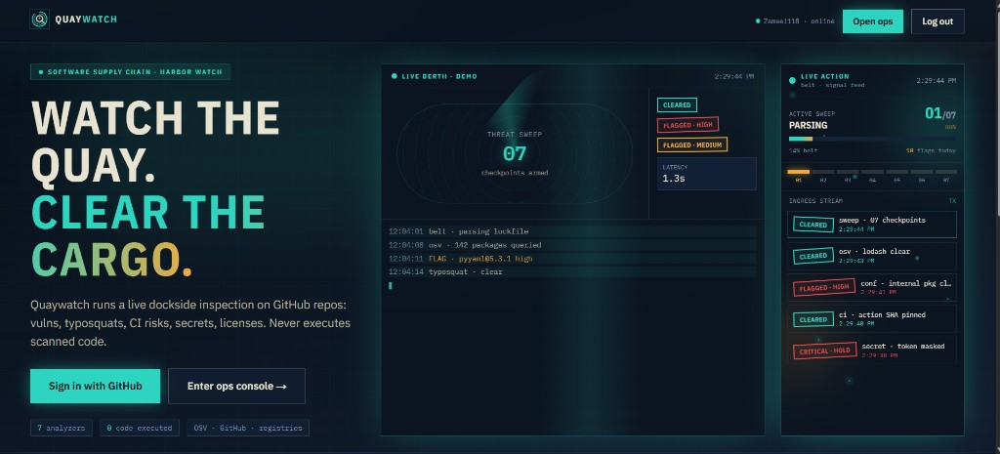
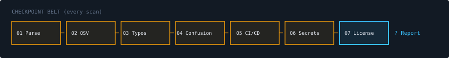

# Quaywatch — User SOP (Standard Operating Procedure)

**Live guide (with images):** [https://supply-chain-security-analyzer.vercel.app/guide](https://supply-chain-security-analyzer.vercel.app/guide)

Use this document offline or in GitHub. Screenshots live under `frontend/public/guide/`.

---

## What Quaywatch does

Quaywatch inspects a **GitHub repository** without running your code. It reads lockfiles, workflows, and source text via the GitHub API, then reports:

| Checkpoint | What it checks |
|------------|----------------|
| 01 Parsing | Lockfiles / manifests (npm, pip, etc.) |
| 02 Vulnerabilities | OSV.dev advisories for pinned versions |
| 03 Typosquats | Package names similar to popular packages |
| 04 Dep confusion | Internal names that also exist on public registries |
| 05 CI/CD | Unpinned actions, risky shell patterns |
| 06 Secrets | Token/key patterns (values never shown in UI) |
| 07 Licenses | GPL/AGPL and policy holds |

---

## Figure 1 — Home page

- **Live berth · demo** (center) and **Live action** (right) are **demos only** before login.
- **Sign in with GitHub** → real dashboard.
- **Enter ops console** → `/dashboard` (requires login).

---

## Figure 2 — Checkpoint belt

Every real scan runs all seven stages in order. Watch progress on the scan detail page.

---

## Ops console (`/dashboard`)

| Area | Purpose |
|------|---------|
| **Ops** | Status board: queued, running, complete scans |
| **Inspect** | Submit a new repo URL |
| **Manifest** | Your scan history |
| **Live** | Your personal activity feed (cyan **Live** badge) |
| **Watchlist** | Pin repos (saved in your browser) |
| **Tour (?)** | Quick UI highlights — use this SOP for deeper context |

### Starting a scan

1. Paste `https://github.com/owner/repo`
2. Choose **project type** (commercial vs open source) for license rules
3. Optional: **private package prefix** (e.g. `@myorg/`) for confusion checks
4. Submit — open the scan when status is **complete**

**Private repos:** use the “private repos” login link on the form to grant `repo` scope.

---

## Reading results

On **scan detail**:

- **Summary cards** — counts by category
- **Stamp badges** — severity (CLEARED, FLAGGED, CRITICAL HOLD)
- **Manifest ledger** — filter findings; expand rows for remediation
- **Graph** — dependency risk view
- **Since last scan** — new vs resolved vs known findings
- **Export** — JSON or PDF

### Acting on findings

| Type | Typical action |
|------|----------------|
| Vulnerability | Upgrade or pin a patched version (OSV link in detail) |
| Typosquat | Remove malicious/typo package; verify lockfile |
| Dep confusion | Use scoped private registry; rename internal packages |
| CI/CD | Pin actions to SHA; avoid `curl \| bash` |
| Secret | Rotate credential; remove from repo history |
| License | Legal review for GPL/AGPL in commercial products |

---

## Strengthening GitHub projects (recommended cadence)

1. **Baseline** — scan `main` after dependency updates; archive PDF exports per release.
2. **Fix critical/high** before merging feature work.
3. **Re-scan weekly** on production repos; watch “since last scan” for regressions.
4. **CI gate** — manually run Quaywatch before tagging releases until you automate (e.g. scheduled scans on Render when enabled).
5. **README badge** — embed SVG badge for trust signal.
6. **Public report** — share read-only link with auditors (revoke when done).

---

## Share link & badge

- **Make report public** — creates `/report/{token}` (unguessable token).
- **Revoke** — invalidates the link immediately.
- **Badge** — Markdown snippet on scan page; shows status only, no secrets.

---

## Security reminders

- Quaywatch never executes repository code.
- OAuth tokens are encrypted server-side; log out on shared machines.
- Public reports expose **findings metadata**, not secret values — still treat as sensitive.

---

## Help

- In-app: **User guide** / **SOP guide** in the header → `/guide`
- Interactive: press **?** on the dashboard for the tour
